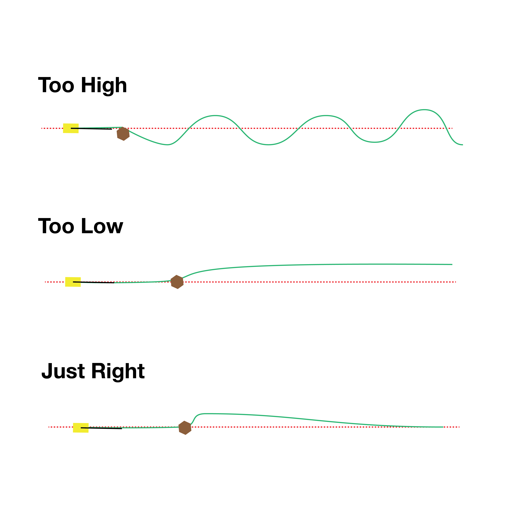
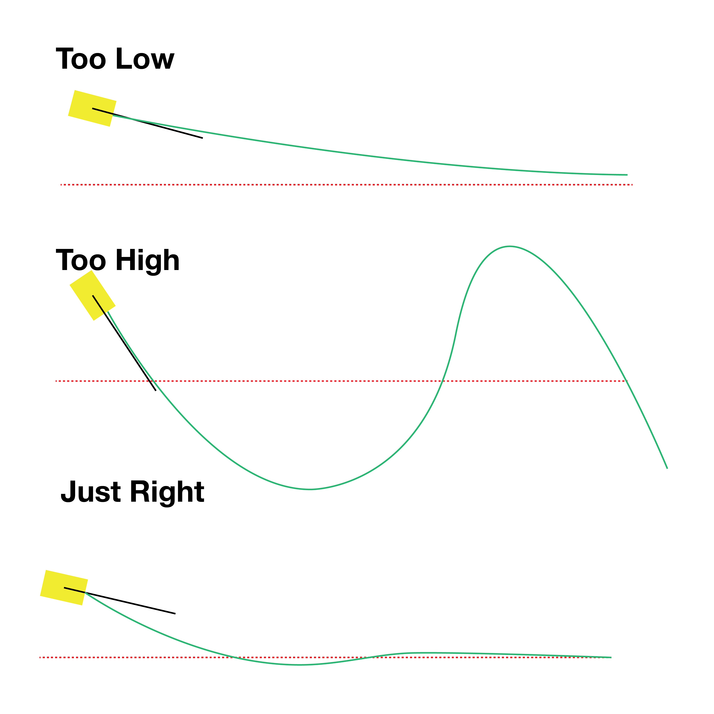

# The PID Controller

The PID controller is made up of two main components: the integral and the derivative

## The Integral
The integral takes into account past error (it is the sum of the error over time) and determines wether or not the derivative part of the controller is sending out a large enough correction to ever get to the middle of the track. Increasing the multiplicative factor of this will change the stability of the car on the track.

Here is an illustration of the heuristics used to tweak the integral gain

## The Derivative
The derivative looks at the rate of change of the distance between the car and the middle of the car to send out the strongness of the action required to get back to the middle of the track. Increasing the multiplicative factor will change the jittering of the car.

Here is an illustration of the heuristics used to tweak the derivative gain

## Parameters
The parameters were tuned manually using the heuristics described above for each term.
